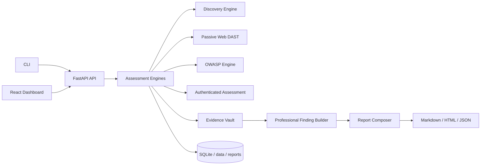

# VulScan

OWASP-focused vulnerability assessment, evidence management, and professional reporting platform for authorised security testing.


VulScan is a local-first Authorised Security Assessment platform for Defensive Security, OWASP-focused Assessment, Vulnerability Management, Evidence Vault workflows, and Professional Reporting. It combines passive scanning, OWASP mapping, authenticated assessment planning, redacted evidence handling, finding building, and report composition in one portfolio-ready product. It is designed for authorised labs, Safe Local Testing, Portfolio Demo Mode, and Manual Validation Workflow. VulScan is not an exploitation framework and does not replace professional manual testing.

## Screenshots

Screenshots are documented in [docs/SCREENSHOTS.md](docs/SCREENSHOTS.md). Placeholder paths:

| View | Path |
| --- | --- |
| Dashboard Home | `docs/screenshots/dashboard-home.png` |
| OWASP Report | `docs/screenshots/owasp-report.png` |
| Evidence Vault | `docs/screenshots/evidence-vault.png` |
| Report Composer | `docs/screenshots/report-composer.png` |
| Portfolio Demo Mode | `docs/screenshots/demo-mode.png` |

## Key Features

- Discovery Engine
- Passive Web DAST
- Vulnerability Intelligence
- Prioritisation and remediation tracking
- OWASP Assessment Engine
- Authenticated Assessment Foundation
- Safe authenticated crawl and session boundary controls
- Role and Permission Mapping
- Access Control Manual Test Planner
- Safe Parameter Replay Planner
- Business Logic Review Assistant
- Evidence Vault with redaction quality controls
- Professional Finding Builder
- Report Composer with Markdown, HTML, and JSON outputs
- Portfolio Demo Mode with Safe Demo Dataset

## Architecture Overview



More diagrams: [docs/diagrams/ARCHITECTURE.md](docs/diagrams/ARCHITECTURE.md).

## Quick Start

```powershell
python -m venv .venv311
.\.venv311\Scripts\activate
pip install -r requirements.txt
.\.venv311\Scripts\python.exe -m pytest
.\.venv311\Scripts\python.exe -m scanner.main demo status
.\.venv311\Scripts\python.exe -m scanner.main api
```

Dashboard:

```powershell
cd dashboard
npm install
npm run dev
```

Open `http://127.0.0.1:5173`.

## Safe Demo

Portfolio Demo Mode uses simulated redacted data only. It does not scan real targets, send live requests, store raw secrets, or include real customer data.

```powershell
.\.venv311\Scripts\python.exe -m scanner.main demo generate --json
.\.venv311\Scripts\python.exe -m scanner.main demo report --markdown --html --json
.\.venv311\Scripts\python.exe -m scanner.main demo walkthrough
```

## Example Local Assessment

Use only on systems you own or have explicit permission to assess. This example targets localhost:

```powershell
.\.venv311\Scripts\python.exe -m scanner.main web-scan --url http://127.0.0.1:8000 --crawl --headers --cookies --forms --passive-summary --a01-checks --a02-checks --a03-checks --a04-checks --a05-checks --a07-checks --a08-checks --a10-checks --owasp-assess --owasp-report --json --html
```

## Safety Statement

Authorised Testing Only.

VulScan is for Responsible Use, Safe Local Testing, Defensive Security, and Authorised Security Assessment only. Do not use it against systems without explicit written permission. Do not store real secrets, raw cookies, bearer tokens, passwords, API keys, private keys, customer data, or sensitive response bodies in the repository, demo data, reports, screenshots, or issue reports.

## Limitations

- Indicator-based findings require Manual Validation Workflow.
- VulScan does not guarantee complete coverage.
- VulScan is not an exploitation framework.
- No exploit automation, credential attacks, or unauthorised scanning are included.
- Demo findings are simulated and must not be treated as confirmed vulnerability claims.
- Professional manual testing remains necessary for real engagements.

## Roadmap

- Improved authenticated assessment workflows.
- Role comparison workflow.
- Report PDF export.
- CI/CD hardening.
- Plugin architecture.
- More safe local test labs.

## Interview Talking Points

- Built a full-stack cybersecurity product with Python 3.11, FastAPI, React, Vite, and TypeScript.
- Designed safety boundaries for Authorised Security Assessment and Defensive Security workflows.
- Mapped evidence into OWASP-focused Assessment outputs with manual validation status.
- Built Evidence Vault and Professional Reporting workflows to avoid unsafe raw evidence export.
- Added Portfolio Demo Mode for safe GitHub screenshots and interview walkthroughs.

## Documentation

Start with [docs/README.md](docs/README.md), [docs/SAFETY.md](docs/SAFETY.md), [docs/PORTFOLIO_DEMO.md](docs/PORTFOLIO_DEMO.md), and [docs/DEMO_WALKTHROUGH.md](docs/DEMO_WALKTHROUGH.md).

## License

MIT. See [LICENSE](LICENSE).
