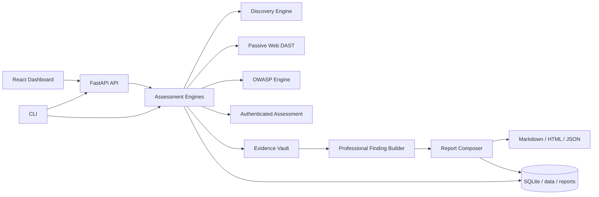
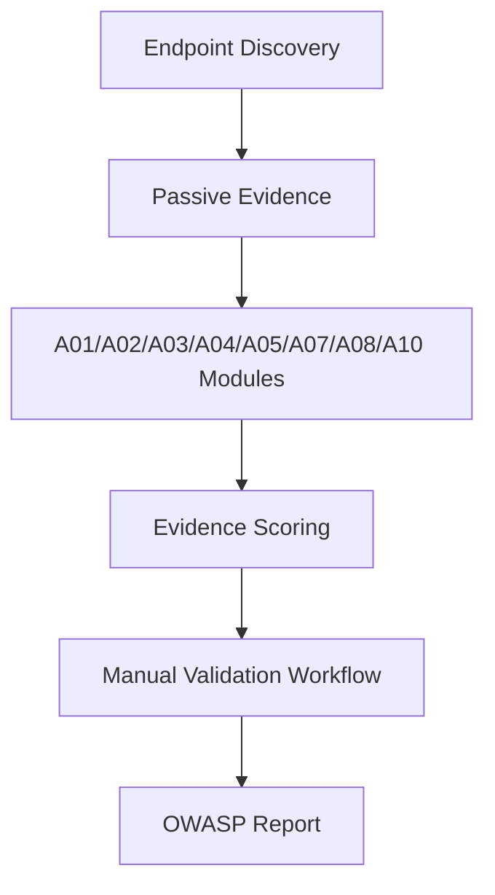
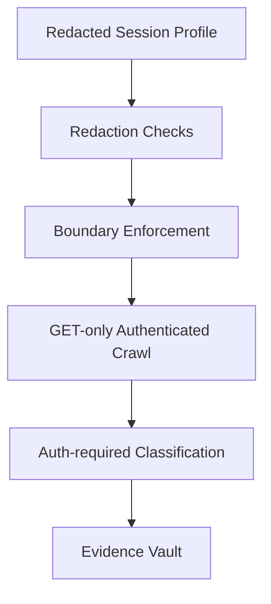
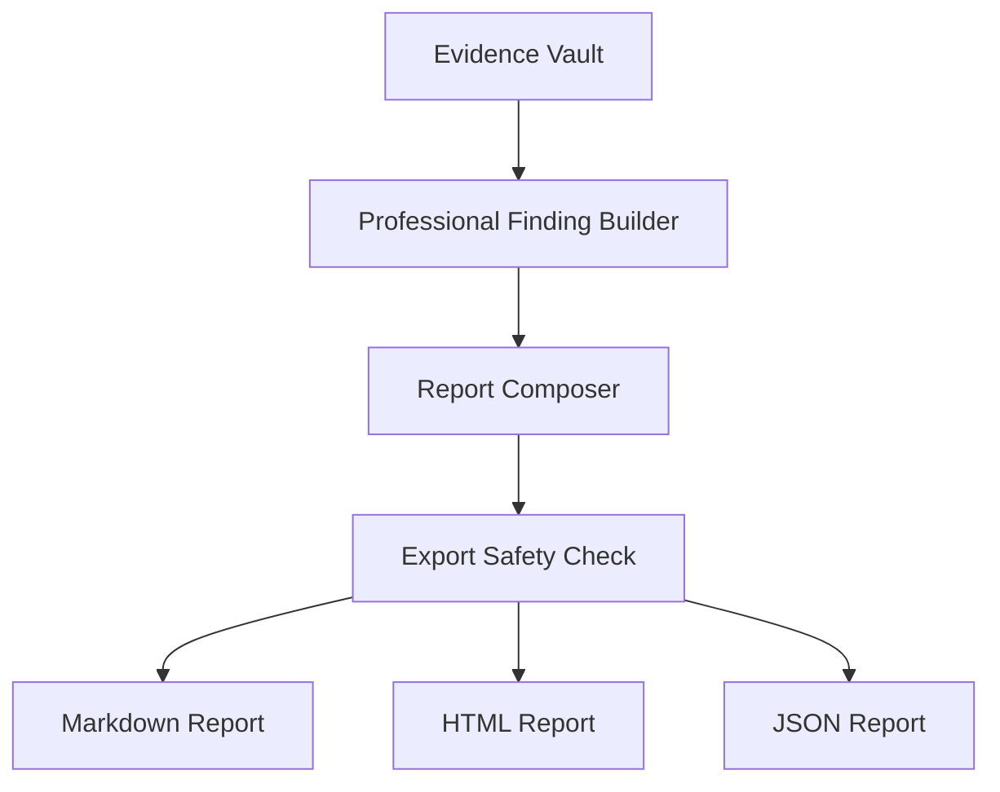

# VulScan Architecture Diagrams

## High-Level Architecture

```mermaid
flowchart LR
    CLI[CLI] --> API[FastAPI API]
    Dashboard[React Dashboard] --> API
    CLI --> Engines[Assessment Engines]
    API --> Engines
    Engines --> Discovery[Discovery Engine]
    Engines --> WebDAST[Passive Web DAST]
    Engines --> OWASP[OWASP Engine]
    Engines --> Auth[Authenticated Assessment]
    Engines --> Evidence[Evidence Vault]
    Evidence --> Findings[Professional Finding Builder]
    Findings --> Reports[Report Composer]
    Reports --> Exports[Markdown / HTML / JSON]
    Engines --> Storage[(SQLite / data / reports)]
    Reports --> Storage
```

## OWASP Assessment Flow

```mermaid
flowchart TD
    Endpoint[Endpoint Discovery] --> Passive[Passive Evidence]
    Passive --> Categories[A01/A02/A03/A04/A05/A07/A08/A10 Modules]
    Categories --> Scoring[Evidence Scoring]
    Scoring --> Manual[Manual Validation Workflow]
    Manual --> Report[OWASP Report]
```

## Authenticated Assessment Safety Flow

```mermaid
flowchart TD
    Profile[Redacted Session Profile] --> Redaction[Redaction Checks]
    Redaction --> Boundary[Boundary Enforcement]
    Boundary --> Crawl[GET-only Authenticated Crawl]
    Crawl --> Classification[Auth-required Classification]
    Classification --> Evidence[Evidence Vault]
```

## Reporting Flow

```mermaid
flowchart TD
    Vault[Evidence Vault] --> Builder[Professional Finding Builder]
    Builder --> Composer[Report Composer]
    Composer --> Safety[Export Safety Check]
    Safety --> Markdown[Markdown Report]
    Safety --> HTML[HTML Report]
    Safety --> JSON[JSON Report]
```

